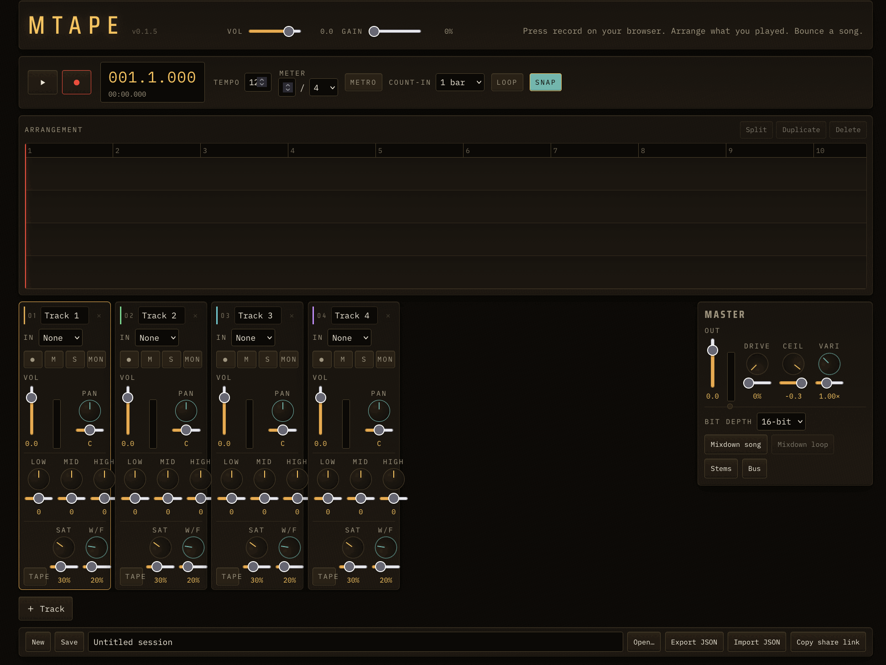

<div align="center">

# mtape

**Press record on your browser. Arrange what you played. Bounce a song.**

[](./package.json)
[](./LICENSE)
[](#verification)
[](./tsconfig.json)
[](https://react.dev)
[](https://vite.dev)
[](https://developer.mozilla.org/docs/Web/API/AudioWorklet)
[](#progressive-web-app)

### [▶ Play it live → mtape.mpump.live](https://mtape.mpump.live)

*The multitrack tape recorder and arranger for the m-suite — the place where your loops become finished songs.*



</div>

---

mtape is a browser-native, local-first multitrack tape recorder. Capture any suite tool (or a
microphone, or a file) onto a track, arrange the takes on a timeline, mix them, and bounce the
result to a WAV — all offline, with no account and nothing uploaded. It is a member of the
[m-suite](#family) of free browser music tools.

## Highlights

- **Record from anywhere** — capture a browser tab (`getDisplayMedia`, so any suite tool at
  *.mpump.live can be a source), a microphone/line-in (`getUserMedia` with all processing
  disabled), or an imported audio file.
- **Non-destructive clip editing** — move, trim (in/out handles), split, duplicate, delete;
  per-clip gain and fades; snap-to-bar toggle against a combined bar/beat + time ruler.
- **A real mixer** — per track: volume, pan, mute/solo, record-arm, input monitor (off by
  default to prevent feedback), and a 3-band EQ. Master bus: gain → optional soft-clip drive →
  brick-wall limiter with a clip LED and peak/RMS metering.
- **Optional mbus input** — set a track's input to **mbus** and pick a sibling instrument from the source list to record its published output directly (tab-to-tab WebRTC via the local link-bridge): no screen-share picker, the exact master feed, works beyond Chromium's tab capture. Off by default; empty and harmless without the bridge.
- **Optional mbus publish** — the "Bus" button in the Master section offers the master mix to the [mbus](https://mbus.mpump.live) patchbay as a source named `mtape` (tab-to-tab WebRTC via the local **mpump** link-bridge, peer-to-peer, no server). Off by default; harmless without the bridge. The vendored mbus-client lives in `src/transport/mbus/` (provenance in its index.ts header).
- **Mixdown & stems** — offline render of the whole song or just the loop region to 16- or
  24-bit WAV, plus per-track stem export. The offline renderer shares its scheduling and DSP
  core with live playback, so a bounce sounds like what you heard.
- **Latency-compensated recording** — takes recorded against playback are shifted back by the
  measured round-trip capture latency so they land on the grid. The compensation is a pure,
  unit-tested function.
- **Tape character (optional, default-off)** — subtle per-track tape saturation and wow/flutter,
  plus a master varispeed control. This is the tool's personality; it stays out of the way until
  you want it.
- **Sessions** — named sessions in IndexedDB (audio stored as encoded blobs), an autosaved
  working session, portable JSON export/import, and a URL-fragment share link for the
  arrangement.
- **Installable & offline** — a PWA with network-first navigation and precached hashed assets;
  fully usable offline after one visit.

## Run locally

```bash
npm install
npm run dev      # http://localhost:5173
```

Open the app, click **Start audio** (browsers require a user gesture before audio can play), and
press record. Use headphones before enabling a microphone or input monitor.

## Scripts

| Script | What it does |
| --- | --- |
| `npm run dev` | Start the Vite dev server. |
| `npm run build` | Type-check the project references, then build to `dist/`. |
| `npm run preview` | Preview the production build locally. |
| `npm run typecheck` | `tsc -b` with no emit. |
| `npm run lint` | ESLint over the whole project. |
| `npm run test` | Run the Vitest suite once. |
| `npm run test:watch` | Vitest in watch mode. |
| `npm run check` | **The full gate:** lint → typecheck → test → build. Must be green before any milestone is done. |

## Keyboard

Ableton-style where notes don't apply; shortcuts are ignored while typing in a field.

| Key | Action |
| --- | --- |
| `Space` | Play / stop the transport. |

## Architecture

```
                            ┌───────────────────────── React UI (main thread) ─────────────────────────┐
  user gesture ──▶ Start    │  App ─ useReducer(state.ts) ─ useEngine() ─ TransportBar / Timeline /      │
                            │                                            TrackStrip / MasterSection /    │
                            │                                            SessionBar                      │
                            └───────────────┬──────────────────────────────────────────┬────────────────┘
                                            │ declarative state push                    │ events (position, meters,
                                            │ (EngineControls / EngineCommand)          │ recordComplete) ▲
                                            ▼                                            │
   sources ─────────────────────▶  AudioEngine (main thread)  ──postMessage──▶  mtape.worklet  (AudioWorklet)
   tab / mic / file                 · AudioContext + node routing               · sample-accurate scheduler
                                     · latency measurement                       · per-track EQ / tape / gain / pan
                                     · capture ⇄ record bus                       · master drive → limiter
                                            │                                            │
                                            ▼                                            ▼
                       ┌────────────── pure, framework-free core (Node-testable) ──────────────┐
                       │ contracts (model + sanitizers) · timing · clipMath · dsp/{gain,eq,     │
                       │ dynamics,tape} · render/renderSession (offline == live) · recording/wav │
                       │ persistence/{db,lastSession,exportImport} · sharing/sessionLink          │
                       └──────────────────────────────────────────────────────────────────────────┘
```

The DSP/logic core is pure (no React, no DOM, no Web Audio) and directly testable in Node. The
worklet owns all sample-accurate scheduling; the UI never schedules audio. Every value crossing a
trust boundary — IndexedDB, localStorage, URL fragments, imported files, worklet messages — is
clamped and validated by the sanitizers in `src/audio/contracts.ts` before use.

## Verification

```bash
npm run check
```

Tests are written first for the pure core: the transport/timing math, clip geometry, the gain and
pan laws, the EQ and dynamics DSP, the tape character, the WAV encoder, the offline renderer, and
the persistence/sharing sanitizers. Live audio (recording, monitoring, metering) is manual-QA —
see the [physical-device checklist](#physical-device-qa-checklist).

## Privacy

Local-first by construction. No account, no cookies, no telemetry, no uploads. Sessions and audio
live in your browser's IndexedDB; share links carry only the arrangement (never audio) in the URL
fragment, which is never sent to a server. Microphone and tab capture happen entirely on-device.

## Browser notes & limitations

- **Tab capture is Chromium-desktop only.** `getDisplayMedia` audio capture is not available on
  Firefox/Safari or on mobile; mtape detects this, disables the Tab input, and says so. Mic and
  file import work everywhere with the Web Audio API.
- **Memory.** Long recordings are chunked to IndexedDB rather than held as Float32 in RAM
  indefinitely; a single clip is capped (see `CLIP_SEC_MAX`). Very large arrangements are still
  bounded by available memory during mixdown — bounce in sections if needed.
- Audio starts only after the **Start audio** gesture (browser autoplay policy).
- **mbus publish** needs the **mpump** link-bridge running locally (`ws://localhost:19876`); without it the "Bus" button just keeps retrying quietly and nothing is published.

### Explicit non-goals (v1)

No MIDI sequencing (see midip / mpump), no plugin hosting, no time-stretching, no automation
lanes, no collaboration. mtape is a tape recorder and arranger, not a full DAW.

## Physical-device QA checklist

- [ ] Start audio, play an empty session — transport counter advances, no glitches.
- [ ] Arm a track, record from the mic — the take lands on the grid (latency-compensated), not late.
- [ ] Record a tab-captured suite tool (Chromium desktop) — audio (not video) is captured.
- [ ] Import an audio file — it decodes and drops onto a track.
- [ ] Move / trim / split / duplicate / delete a clip; toggle snap-to-bar.
- [ ] Mute / solo / pan / EQ per track; input monitor off by default, no feedback.
- [ ] Master limiter holds the ceiling on a hot mix; clip LED lights.
- [ ] Enable tape saturation + wow/flutter and varispeed — subtle, musical, no artefacts.
- [ ] Mixdown the song and the loop region to 16- and 24-bit WAV; export stems.
- [ ] Save / load / rename sessions; export & re-import JSON; open a share link (arrangement only).
- [ ] Reload offline (after one online visit) — the app still loads and plays.

## Repository map

```
src/
  main.tsx                      app entry + service-worker registration
  styles/global.css             tape-deck theme tokens + component styles
  audio/
    contracts.ts                session model, hard bounds, sanitizers (the trust boundary)
    messages.ts                 UI ↔ worklet command/event unions + validation
    engineApi.ts                EngineControls interface
    AudioEngine.ts              main-thread engine (context, routing, capture, latency)
    worklets/mtape.worklet.ts   sample-accurate multitrack processor
    dsp/{gain,eq,dynamics,tape}.ts   pure DSP primitives
  transport/timing.ts           tempo / bars:beats / snapping / latency compensation
  clips/clipMath.ts             clip move / trim / split / fades geometry
  render/renderSession.ts       offline mixdown (reference for live playback)
  recording/wav.ts              16/24-bit PCM WAV encoder
  persistence/{db,lastSession,exportImport}.ts   IndexedDB + autosave + JSON portability
  sharing/sessionLink.ts        URL-fragment arrangement share codec
  app/{state,useEngine,App}.tsx  reducer, engine bridge, composition
  components/                   TransportBar, Timeline, TrackStrip, MasterSection, SessionBar, …
public/                         manifest, service worker, icons, version probe
```

## Progressive Web App

mtape ships a hand-written service worker (`public/sw.js`): network-first for navigations,
cache-first for content-hashed `/assets/*`, and stale-while-revalidate for the rest of the shell.
The first visit precaches the hashed bundle (via a Vite-emitted manifest) so a subsequent offline
load works. Install it from your browser's address bar or app menu.

## Deployment

Static build (`npm run build` → `dist/`), served at the domain root (`mtape.mpump.live`). Set
`VITE_BASE_PATH` to deploy under a subpath.

## Family

Part of the **m-suite** of free, local-first browser music tools: mpump, mloop, mdrone, mchord,
mgrains, mspectr, mscope — and now mtape. Record any of them onto a track and arrange them here.

## License

[AGPL-3.0-or-later](./LICENSE).
